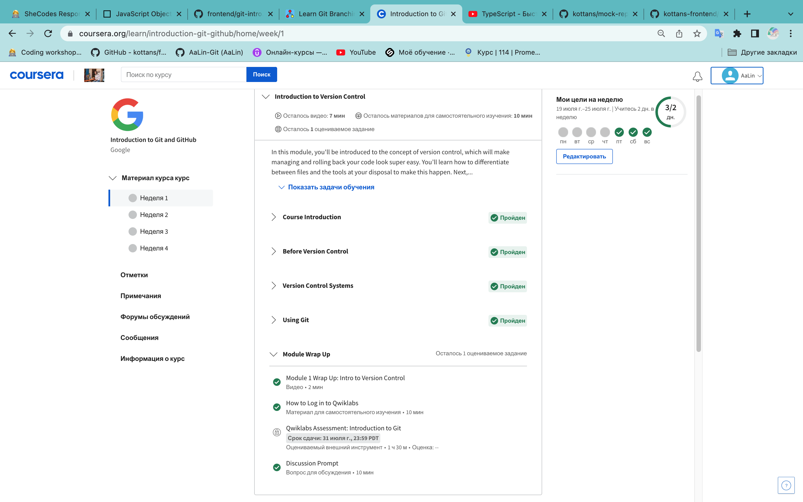
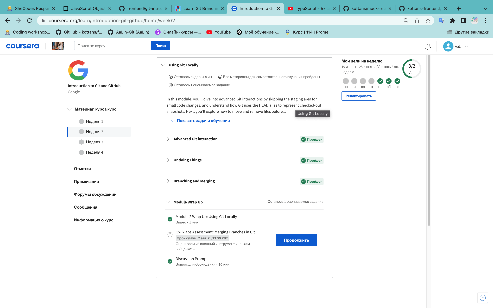
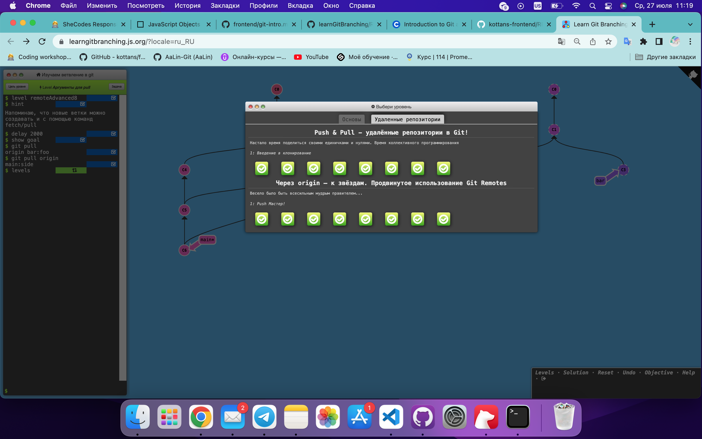
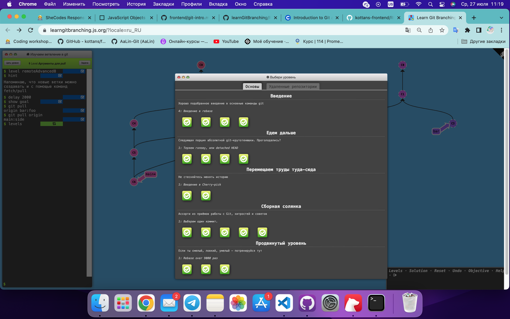

0. Git basics

I took the Introduction to Git and GitHub course on the Coursera. This was completely new information for me. I have learned many different commands. I was surprised that there is even a git help command that gives information on any command. I think I will use this often.

Then I practiced with https://learngitbranching.js.org/?locale=ru_RU. This game helped me remember most of the commands and learn new ones.

