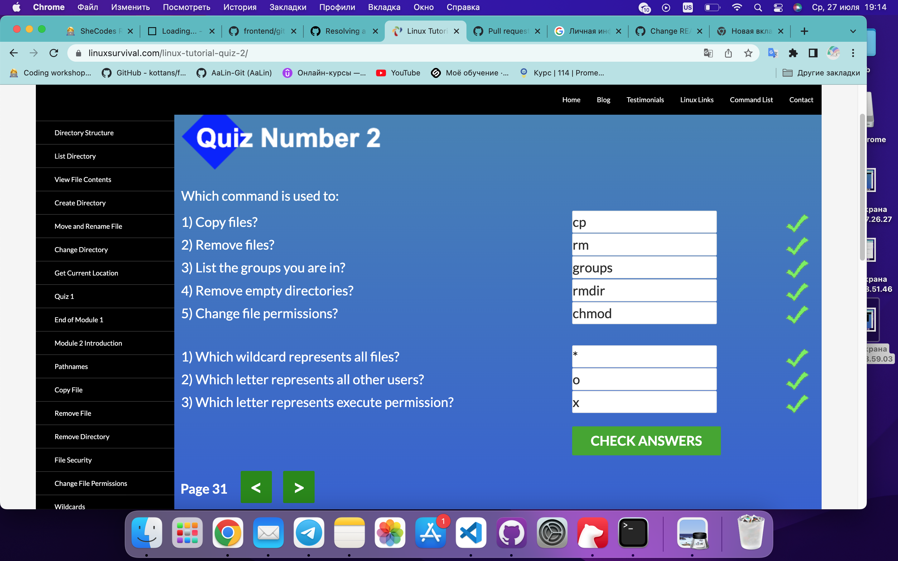

# Stage 0

## 0. Git basics

I took the [Introduction to Git and GitHub](https://www.coursera.org/learn/introduction-git-github) course on the Coursera. This was completely new information for me. I have learned many different commands. I was surprised that there is even a git help command that gives information on any command. I think I will use this often.

Then I practiced with [learngitbranching](https://learngitbranching.js.org/?locale=ru_RU). This game helped me remember most of the commands and learn new ones.

## 1.Linux CLI, and HTTP

While I was going through [Linux survival](https://linuxsurvival.com) I learned a lot of new Linux commands, such as cat, df, ps, grep etc. A lot of them I learned in the previous course. It's really powerful, so I will use it a lot.

I also read articles about the http protocol. All information was very useful and new to me.

## 2.Git Collaboration

I took the [Introduction to Git and GitHub](https://www.coursera.org/learn/introduction-git-github) course on the Coursera, week 3 and 4. I already knew some commands from previous lessons, like fetch, merge, pull, push etc. I learned a lot about code review and tracking issues. Maybe it would be useful in the future.

## Intro to HTML and CSS

I took 1 and 2 weeks of the course [HTML, CSS, and Javascript for Web Developers](https://www.coursera.org/learn/html-css-javascript-for-web-developers). I learned a lot about the W3C validator, semantic tags, HTML entities, CSS box-sizing etc. What surprised me the most was the CSS rule "Last declaration wins". This cleared up a lot of the bugs I've run into before 😅

I took the courses [Learn HTML](https://www.codecademy.com/learn/learn-html) and [Learn CSS](https://www.codecademy.com/learn/learn-css) on Codeacademy. They weren't new for me.

